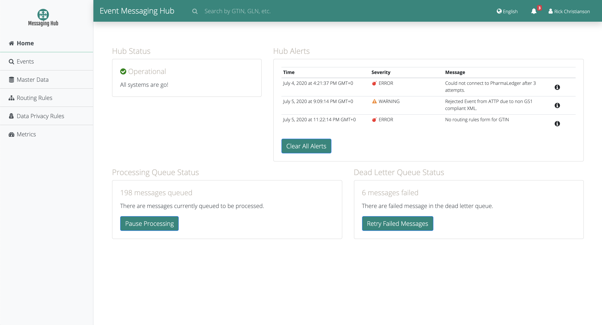
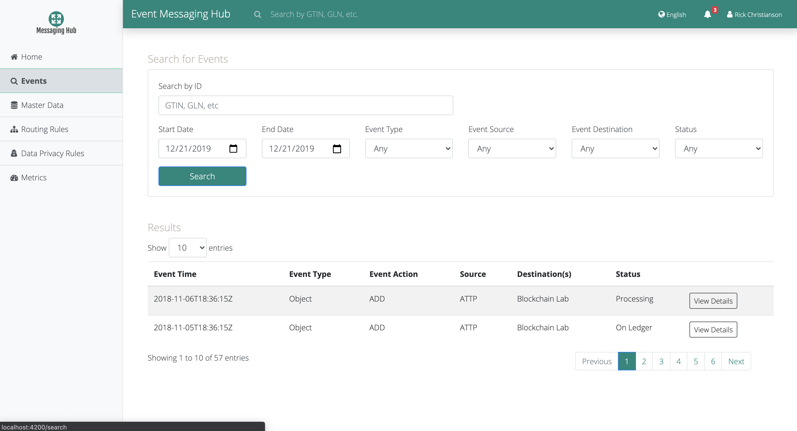
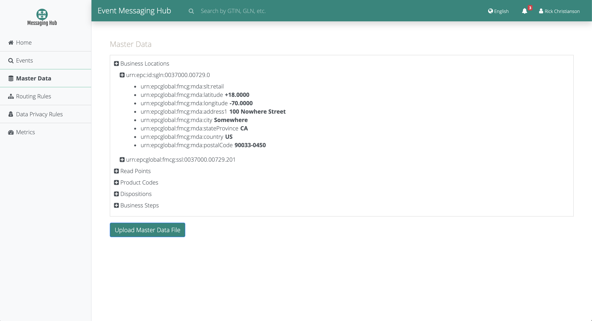
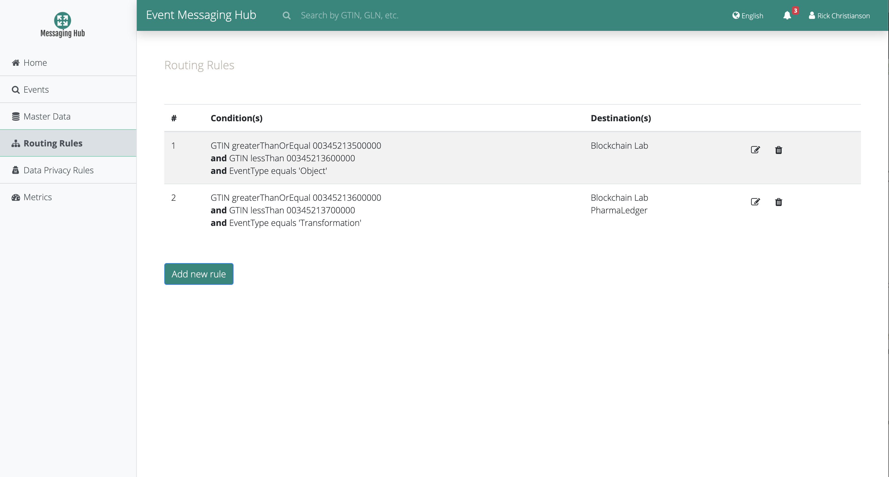
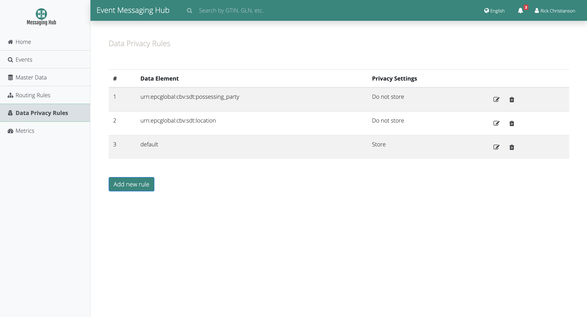
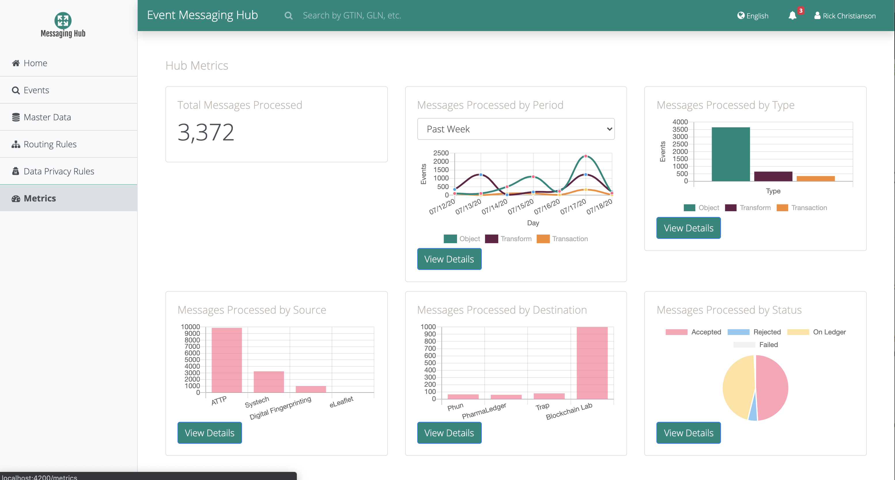

# Messaging Hub Administration UI

## Overview

### Purpose:

The Messaging Hub UI allows Hub users to interact with the hub backend to determine hub status,
determine event status, search for events, manage master data and various rules for their organization.

### Implementation:

This project was generated with [Angular CLI](https://github.com/angular/angular-cli) version 8.3.5.

It calls both the Authentication BFF and Adminstration BFF endpoints to perform backend functions

### Primary functions:

User Login, Password management

Hub Status

Search for Events

Manage Master Data

Manage Routing Rules

Manage Data Privacy Rules

View Metrics

## Getting Started

These instructions will get you a copy of the project up and running on your local machine for development and testing purposes. See deployment for notes on how to deploy the project on a live system.

### Development server

To run the development server connecting to local services, run `ng serve --proxy-config local.proxy.conf.json --host 0.0.0.0`.

To run the development server connecting to deployed services, run `ng serve --proxy-config proxy.conf.json --host 0.0.0.0`.

Navigate to `http://localhost:4200/`. The app will automatically reload if you change any of the source files.

### Code scaffolding

Run `ng generate component component-name` to generate a new component. You can also use `ng generate directive|pipe|service|class|guard|interface|enum|module`.

### Build

Run `ng build` to build the project. The build artifacts will be stored in the `dist/` directory. Use the `--prod` flag for a production build.

### Running unit tests

Run `npm test` to execute the unit tests via [Jest](https://jestjs.io/).

### Running end-to-end tests

Run `ng e2e` to execute the end-to-end tests via [Protractor](http://www.protractortest.org/).

### Further help

To get more help on the Angular CLI use `ng help` or go check out the [Angular CLI README](https://github.com/angular/angular-cli/blob/master/README.md).

## Deployment

This project is fully integrated in the CI/CD pipeline. To deploy this code, create a merge
request in the Git repository and merge that into the develop branch.

Deployment is performed by the pipeline using Helm charts which spin up the necessary number of pods on a Kubernetes environment.

### Environment setup

This project require the following environment variables to be properly configured:

### Rolling back a release

Instructions on how to rollback a release can be found in ....

### Starting/Stopping the Service

All services are deployed as Kubernetes-managed pods on the IBM Cloud. Please refer to the official
[Kubernetes documentation](https://kubernetes.io/docs/reference/kubectl/cheatsheet/) for common commands.

## Monitoring

Health check endpoint is host:port/actuator/health.
